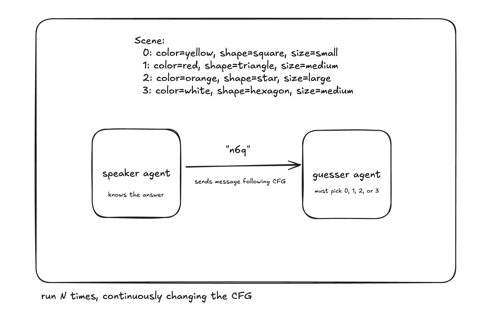

# create "neuralese" with gpt5 and context free grammars (CFG)

### project goal

this is a multi agent system running a loop that evolves context-free grammars to optimize communication between GPT-5 agents. The system automatically discovers shorter, more efficient message formats while maintaining high accuracy.

### why its interesting

this is a constrained example on a mini game. but this experiment seems to be standard in other research. according to them, if this mini game works, it can extend to a real grammar for an entire language. this shows that if you wanted to build / learn a cfg to do neuralese you probably can. you just need to run a bigger experiment for longer

### how it works


the agents play a guessing game (Lewis Signaling Games) over many rounds. in each round, there are 4 options the speaker must encode in their language and send to the guesser such that the guesser will correctly decode it and select the correct option. the speaker can only send messages that follow the current CFG. after every round, the CFG is updated and optimized based on metrics below.

### commands for demo

```bash
uv run python main.py --rounds 3 --batch-size 5 # run main loop to optimize
```

```bash
uv run test_step3.py # show an example guessing round
```

```bash
uv run scripts/qa.py # play a guessing game based on final CFG
```

### Full Evolution

```bash
# Run evolutionary optimization (10 rounds, batch size 10)
uv run python main.py --rounds 10 --batch-size 10

# Custom parameters
uv run python main.py --rounds 5 --batch-size 5 --artifacts-dir my_run
```

### CLI Options

- `--rounds N`: Number of evolutionary rounds (default: 10)
- `--batch-size N`: Scenes per evaluation (default: from config)
- `--artifacts-dir DIR`: Directory for logs and grammar snapshots
- `--verbose`: Show detailed examples

## 📁 Project Structure

```
cfg-neuralese/
├── main.py                    # 🚀 Main evolutionary loop
├── configs/
│   └── defaults.yaml         # Configuration (batch size, lambdas)
├── src/
│   ├── agents/
│   │   ├── openai_client.py  # 🤖 OpenAI API integration
│   │   ├── speaker.py        # 📢 Message generation (inline prompts)
│   │   ├── listener.py       # 👂 Message interpretation (inline prompts)
│   │   └── proposer.py       # 🧠 Grammar mutation suggestions
│   ├── grammar/
│   │   ├── base_grammar.lark # 📝 Starting grammar
│   │   ├── mutations.py      # 🔧 Apply grammar patches
│   │   └── utils.py          # Grammar utilities
│   ├── env/
│   │   ├── scenes.py         # 🎭 Scene generation
│   │   └── scoring.py        # 📊 Metrics calculation
│   └── loop/
│       └── evaluate.py       # 🔍 Evaluation pipeline

├── tests/                     # 🧪 Unit tests
└── artifacts/                 # 📈 Evolution logs & grammars
```

## 🔧 Core Components

### 1. Grammar System

- **Base Grammar**: Human-readable Lark grammar for object descriptions
- **Mutation Operations**: `rename_terminal`, `replace_rule`, `remove_separators`
- **Patch Application**: Robust grammar transformation with validation

### 2. Agent System

- **Speaker**: Generates CFG-compliant messages describing target objects
- **Listener**: Predicts target object index from message and scene
- **Proposer**: Analyzes performance and suggests grammar improvements

### 3. Evolution Loop

- **Multi-round optimization** with smoke testing
- **Automatic stopping** when targets are met (acc ≥ 97%, len ≤ 10)
- **Artifact logging** for analysis and reproducibility

## 📊 Example Output

```
🔄 Round 0
==================================================
📈 Results:
  Accuracy: 1.000 (10/10)
  Avg Message Length: 17.5 chars
  Collision Rate: 0.000
  Parse Fail Rate: 0.000

🤖 Asking proposer for mutations...
✅ Proposer returned 3 mutations
🔧 Applying mutations...
✅ Patch accepted!

🔄 Round 1
==================================================
📈 Results:
  Accuracy: 1.000 (10/10)
  Avg Message Length: 12.3 chars  ← Improved!
  Collision Rate: 0.000
  Parse Fail Rate: 0.000
```

## 🎯 Performance Targets

- **Baseline**: acc ≥ 97%, len ~15-30 chars
- **After evolution**: acc ≥ 95%, len ≤ 10-12 chars
- **Phase transition**: When proposer discovers ultra-compact formats (3-6 chars)

## 🚀 Getting Started

1. **Install dependencies**:

   ```bash
   uv add openai pyyaml lark matplotlib numpy
   ```

2. **Set OpenAI API key**:

   ```bash
   export OPENAI_API_KEY="your-key-here"
   ```

3. **Run evolution**:
   ```bash
   uv run python main.py --rounds 3 --batch-size 5
   ```

## 🔬 Development

### Running Tests

```bash
uv run python -m pytest tests/
```

### Adding New Mutations

Extend `src/grammar/mutations.py` with new operations and update the `ALLOWED_OPS` in the proposer.

### Custom Evaluation

Modify `src/loop/evaluate.py` to add new metrics or change the evaluation logic.

## 📈 Future Work

- **Top-K Evolution**: Keep multiple grammar variants for exploration
- **Robustness Testing**: Add noise injection and robustness metrics
- **Visualization**: Plot accuracy vs length evolution over rounds
- **Multi-seed Experiments**: Compare different starting grammars

---

**Status**: 🟢 **Production Ready** - Evolutionary loop working, ready for research and optimization!
